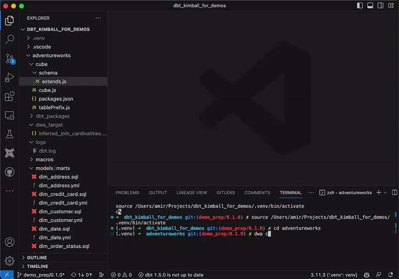

Project curator: [Amir Jaber](https://github.com/Terroface)
# dwa - Data Warehouse Automation

Data Warehouse Automation (dwa) is a tool designed to automate routine tasks involving your cloud-based data warehouse. 

The current version supports [**Snowflake data warehouses**](https://www.snowflake.com/en/) and generates [**Cube.js**](https://cube.dev/) semantic files.

This is a work in progress. If you would like to make changes accomodate your workflow, see section `contribute`.

**Table of Contents**
- [Demo](#demo)
- [Usage](#usage)
- [Configuration](#configuration)
- [Assumptions About Your Data Warehouse](#assumptions)
- [Contribute](#contribute)
- [Project Architecture](#architecture)


***
## Demo: generate Cube code based on an information_schema




***
## Usage
The tool is easy to use and requires minimal setup. Here is a quick start guide:

1. Configure your project and connections by following the instructions provided in the `configuration` section.
2. Install `dwa` by following the steps provided in the `how to develop` section.
3. Navigate to your analytics repo.
4. Run the CLI commands that are available.

The CLI commands are used to perform various operations. Here's a brief overview:

- `dwa --help` or `dwa -h`: Shows the available sub-commands.
- `dwa cube`: Generates `Cube` (previously `cube.js`) code based on an `information_schema`.

You can get more details on each command and its options by running `dwa <command> -h`. For more detail on how these commands work, see `project architecture`.


***
## Configuration
Before running the program, you need to set up two configuration files:

### project.yml
This file should be stored at the top of your repo (this can be overridden by the `project_dir` argument at runtime). It contains information about your project.

Example configuration:
```yml
profile: profile_name # The name of your profile that matches the name in `profiles.yml`

join_inference_enabled: true # set to false to disable join inference
join_query_time_threshold: 30 # number of seconds before join inference will be skipped for a table pair

field_description_path: warehouse_docs # If you have dbt-compatible field descriptions in doc blocs, this is the folder that contains them
field_description_file_name: field_descriptions.md # The name of the markdown file that contains field descriptions

cube_path: cube/schema # The location where your Cube output file will be stored
```

In cases of larger databases, the process of inferring joins may consume a considerable amount of time. Therefore, you can choose to enable or disable the join inference feature in the `project.yml` configuration file. 

Furthermore, you can set a warning threshold for the maximum permitted time for a single join inference query in the `project.yml` configuration file. If a query exceeds this threshold, a warning is printed in the terminal, and the table pair in question is skipped for join inference. The names of such tables are preserved in a configuration file and are skipped in future runs to prevent repeating time-consuming queries.

### profiles.yml
This file should be stored in a `.dwa/` folder in the user's home directory (this can be overridden by the `profile_dir` argument at runtime). It contains the details of your data warehouse profile.

Example configuration:

```yml
profile_name: # The name of your profile.
  account: va83945.eu-west-1.aws # Your Snowflake account name
  database: your_database_name # The name of your Snowflake database
  password: hunter2 # Your Snowflake account password
  schema_name: your_schema # The name of the schema in your Snowflake database
  user: amir # Your Snowflake username
  warehouse: your_warehouse # The name of your Snowflake warehouse.
  warehouse_name: snowflake # The type of your warehouse (currently, only `snowflake` is supported).
```
### Optional - Setting Up the OpenAI API Key
To utilize the Large Language Model (`--llm`) functionality, you need to set the OpenAI API key in your environment variables. The key should be assigned to the variable `OPENAI_API_KEY`.

***
## Assumptions About Your Data Warehouse

**dwa** operates optimally when your data warehouse adheres to specific naming conventions. These conventions aid modules to, among other things:
* accurately infer table relationships

While these conventions are not strict requirements for **dwa** commands to operate, complying with them can significantly enhance the accuracy of the output. 

The assumptions are as follows:

1. **Primary Key (PK) Suffixes**: **dwa** expects primary keys in your tables to be suffixed with `_pk`. For instance, the primary key for a table named `orders` would be `order_pk`.

1. **Foreign Key (FK) Suffixes**: In a similar fashion, **dwa** assumes foreign keys to be suffixed with `_fk`. For example, a foreign key pointing to the `orders` table would be `order_fk`.

1. **Unicity**: dwa expects primary keys in your tables to be unique.

1. **Table Name Prefixes and Suffixes**: **dwa** understands that your table names may carry various prefixes (like `fact_`, `dim_`, `xa_`) and are typically suffixed with the plural form of the primary key prefix. For instance, a fact table linked to the `orders` table might be named `fact_orders`.

1. **Foreign Key Naming**: **dwa** presumes that a foreign key will carry the exact same name as the primary key it refers to, barring the suffix. So, a foreign key referring to `order_pk` would be named `order_fk`.

1. **Lowercase and Underscores**: **table** and **column names** are assumed to `be_in_this_format`


***
## Contribute
Contributions to this project are always welcome. If you're interested in contributing, the sections below provide some useful information to help you get started. If you find anything unclear, feel free to reach out by creating an issue or suggestion on GitHub.

###  How to develop
Follow these steps to contribute to the project:

1. Clone this repository.
2. Create a new branch.
3. Make changes and save your files. If you wish to add a new non-native Python package, include it in `setup.install_requires` in `setup.py`.
4. Test your changes by installing your local files as a package using `pip3 install -e /path/to/dwa`. The `-e` flag ensures you don't need to re-install on every change.
5. Raise a PR into the `main` branch. Once approved, your changes will be merged.


***
## Project architecture
The project is organized into several modules, each with a specific responsibility and functionality. For a detailed understanding of each module and the project's design, please refer to the individual module descriptions at the top of each python file.

The sections below detail some high level knowlege about the project. Each section can pertain to more than one module.

### main.py
This project starts with the `main()` function in `data_warehouse_automation/main.py`. This function is the entry point of the package and orchestrates the interaction between all other functions. When a `dwa` command is run, the `main()` function is triggered first, serving as the initiation point for the rest of the program. If you are new to the project and trying to understand how everything fits together, starting with `main()` is your best bet.


### dwa cube - overview

The `cube` module is responsible for connecting with your Snowflake database, gathering schema information, and using this data to generate a `base.js` file. This file follows the Cube.js syntax and contains predefined `dimensions` and `measures` for your data. This module is initiated by running the `dwa cube` command.

This feature enables you to have a dynamically updated schema file for Cube.js that reflects your current Snowflake schema, minimizing manual intervention and reducing error. If the module doesn't get the configurations right, you can easily modify them with cube's `extend` functionality.

Under the hood, the `generate_cube_js_base_file()` function orchestrates this process. This function takes in table and column information from the database and a target file path for the output file. It then processes each table and its respective columns, applying specific rules based on the data types of the columns to create dimensions and measures for the Cube.js schema:

- If the column is a primary or foreign key, or if its data type is `string`-like (such as `'text'`, `'varchar'`, `'string'`, etc.), it's defined as a `string` dimension in Cube.js.
- Primary keys are marked (`primaryKey: true`)
- Primary and foreign keys are hidden (`public: false`).
- Numeric columns (like `'number'`, `'numeric'`, `'float'`, etc.) are defined as `sum` measures.
- `Date`, `time`, and `timestamp` type columns are defined as `time` dimensions.
- `Boolean` type columns are created as `boolean` dimensions.

Optional arguments
* The `--llm` flag is available with this command and when used, it will make use of a large language model to infer semantics. See more in section [dwa cube - using the Large Language Model](#dwa-cube---using-the-large-language-model)

To view more optional arguments, use the `dwa cube -h` command.

### dwa cube - output schema design
There are some designs inherent in the cube output `base.js` file that is worth being mindful of
* The cubes are hidden by default
* The cubes have the `_base` suffix in their name. This is to allow the cube's `extend` to use the prefix as its name without causing a conflict. E.g. `dimCustomers_base` should be manually extended to `dimCustomers`.
  * Note: The joins reference the name without the `_base` suffix

### dwa cube - using the Large Language Model
The `--llm` flag enhances the `dwa cub`e command by enabling semantic inference from your database schema using the OpenAI GPT-3.5-turbo model. It provides insight into key columns, dimension types, and potential measures for each column, significantly improving the generation of the Cube.js `base.js` file.

To use this, you will need [an environment variable with your OpenAI api key](#optional---setting-up-the-openai-api-key) assigned.

### dwa cube - environment variables
A key feature of this module is its incorporation of environment variables, namely `databaseSchema` and `databaseName`, which are used to dynamically specify the database and schema that the cubes' `sql:` value references. This is demonstrated in the following code block:

```javascript
import { databaseSchema, databaseName } from '../tablePrefix';

cube(`dimAddress_base`, {

  sql: `select * from ${databaseName()}.${databaseSchema()}."DIM_ADDRESS"`,

  // the rest of dimAddress

  cube(`dimCreditCard_base`, {

  sql: `select * from ${databaseName()}.${databaseSchema()}."DIM_CREDIT_CARD"`,

  // the rest of the output

```

**Note**: two things are needed before you can import them to your `base.js` file:
1. Enable imports for your account ("tenant") - reach out to the cube team to do so.
2. Export environment variables - in the dir above `schema/`, you need to make a `tablePrefix.js` file with the following:

```javascript
exports.databaseSchema = () => process.env.CUBEJS_DB_SCHEMA;
exports.databaseName = () => process.env.CUBEJS_DB_NAME;
```

This approach greatly enhances the robustness of your Cube.js setup by providing clear environment separation. By adjusting the values of these environment variables, developers can switch between different databases and schemas without having to manually edit the schema files. This flexibility is particularly beneficial in CI/CD pipelines and multi-environment setups where you might have separate development, testing, and production databases.

In the context of CI/CD, the environment variable functionality contributes to automated, reliable deployment processes. You can use these variables to point your cube configurations to the appropriate database environment for each stage of your pipeline, ensuring isolation between development, staging, and production.

Furthermore, the module simplifies schema updates. Should your Snowflake schema change, the `cube` module can re-generate the `base.js` file to reflect these changes, minimizing manual intervention and reducing the risk of errors.